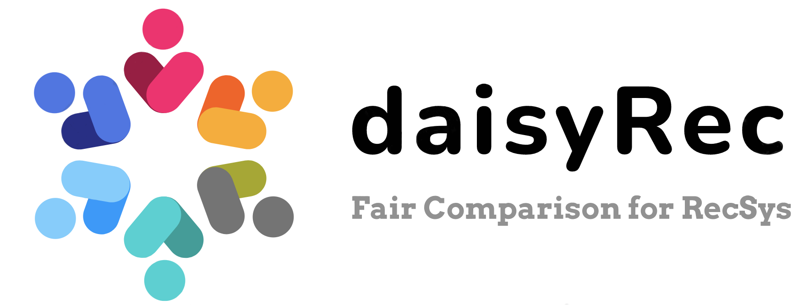
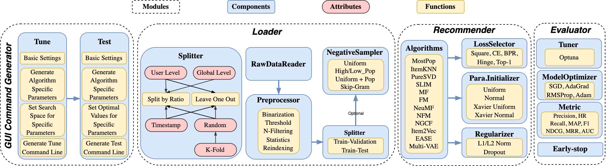

<p align="left">

</p>

 
[](https://github.com/recsys-benchmark/DaisyRec-v2.0) 
 

[](https://arxiv.org/abs/2206.10848)

## CA6124 Individual Project

This repository extends DaisyRec-v2.0 with **Collaborative Denoising
Auto-Encoder (CDAE)** and compares it with the framework's **EASE** and
**Multi-VAE** implementations on MovieLens 1M and Amazon Digital Music
(2014 ratings-only). The original DaisyRec behaviour remains the default;
the following reproducibility options are opt-in:

- deterministic full-calendar-day temporal boundaries;
- warm-start-only evaluation, with retained interactions/users reported;
- full ranking over training-seen items, masking each user's training items;
- configurable validation objective cutoff (NDCG@10 in this project);
- optional per-user NDCG output for paired statistical inference.

The experiment uses DaisyRec's one-pass `10filter`, an approximately 80/20
global temporal split, the most recent 10% of the training portion for
validation, and 20 Optuna trials for every model-dataset combination. Because
the datasets differ simultaneously in domain, scale and sparsity, comparisons
are descriptive rather than causal.

CDAE and Multi-VAE use the same fixed 50-epoch training budget with early
stopping disabled. Multi-VAE's KL schedule advances once per mini-batch and
uses `total_anneal_steps=400`, so every searched annealing cap is reached
within the actual training run.

### Data

MovieLens 1M belongs in `data/ml-1m/`. The repository submission may contain a
size-limited MovieLens sample only; reproduce the reported results with the
complete official GroupLens `ratings.dat` (1,000,209 ratings). Download the
Amazon 2014 Digital Music
ratings-only file, decompress it as
`data/amazon-music/ratings_Digital_Music.csv`, and verify its SHA-256 digest:

```
fdf164882460ff26fa2521e01f6a9cf8005ad252ddce308dd03519064f02d80e
```

The Amazon CSV has no header and contains user, item, rating and Unix timestamp
columns. Run the auditable preprocessing/split diagnostic with:

```bash
python scripts/diagnose_datasets.py
```

### Reproduce the experiments

```bash
pip install -r requirements.txt
python -m unittest tests/test_assignment_extensions.py
TRIALS=20 scripts/run_tuning.sh
python scripts/run_final_tests.py
python scripts/summarize_results.py
python scripts/paired_bootstrap.py
python scripts/build_report.py
```

Tuning results are written to `tune_res/`, final metrics to `res/`, and logs
to `experiment_logs/`. `scripts/run_tuning.sh` uses persistent Optuna studies,
so an interrupted run resumes until the requested total trial count is met.
Submission-ready copies are versioned under `results/` (all six trial histories,
all six KPI files, summary tables and figures) and `report/` (DOCX and PDF).

### Added files

- `daisy/model/CDAERecommender.py`: modular CDAE implementation.
- `daisy/utils/evaluation.py`: opt-in warm-start and full-ranking utilities.
- `scripts/diagnose_datasets.py`: dataset/filter/split diagnostics.
- `scripts/run_tuning.sh` and `scripts/run_final_tests.py`: reproducible runs.
- `scripts/paired_bootstrap.py`: seeded paired NDCG@10 confidence intervals.
- `tests/test_assignment_extensions.py`: regression and extension tests.

## Overview

<!--  -->

DaisyRec-v2.0 is a Python toolkit developed for benchmarking top-N recommendation task. The name DAISY stands for multi-**D**imension f**A**irly compar**I**son for recommender **SY**stem. Since its release, DaisyRec has undergone continuous upgrades and updates. The table below shows the code version and its corresponding research paper, and DaisyRec-v2.0 (dev branch) is the latest version. ***(Note that DaisyRec-v2.0 is still under testing. If there is any issue, please feel free to let us know)*** 

| **Version** | **Papers** |
|-------------|-----------------|
| [DaisyRec](https://github.com/AmazingDD/daisyRec)   | Are We Evaluating Rigorously? Benchmarking Recommendation for Reproducible Evaluation and Fair Comparison |
| [DaisyRec2.0-main](https://github.com/recsys-benchmark/DaisyRec-v2.0/tree/main)| DaisyRec 2.0: Benchmarking Recommendation for Rigorous Evaluation |
| [DaisyRec2.0-dev](https://github.com/recsys-benchmark/DaisyRec-v2.0/tree/dev) | Under upgrade and optimizition|

The figure below shows the overall framework of DaisyRec-v2.0. 

<p align="center">

</p>


## Tutorial - How to use DaisyRec-v2.0

### Pre-requisits

Make sure you have a **CUDA** enviroment to accelarate since the deep-learning models could be based on it. 

<!---->

### How to Run

```
python test.py
python tune.py
```

#### Earlier Version of GUI Command Generator and Tutorial
- The GUI Command Generator is available [here](http://DaisyRecGuiCommandGenerator.pythonanywhere.com).

- Please refer to [DaisyRec-v2.0-Tutorial.ipynb](https://github.com/recsys-benchmark/DaisyRec-v2.0/blob/main/DaisyRec-v2.0-Tutorial.ipynb), which demontrates how to use DaisyRec-v2.0 to tune hyper-parameters and test the algorithms step by step.

#### Updated Version of GUI Command Generator and Tutorial

- The updated GUI Command Generator is available [here](https://daisyrec.netlify.app/).

- Please refer to [DaisyRec-v2.0-Tutorial-New.ipynb](https://github.com/recsys-benchmark/DaisyRec-v2.0/blob/dev/DaisyRec-v2.0-Tutorial-New.ipynb), which demontrates how to use DaisyRec-v2.0 to tune hyper-parameters and test the algorithms step by step.

## Documentation 

The documentation of DaisyRec-v2.0 is available [here](https://daisyrec.readthedocs.io/en/latest/), which provides detailed explainations for all commands.

## Implemented Algorithms

Below are the algorithms implemented in DaisyRec-v2.0. More baselines will be added later.

- **Memory-based Methods**
    - MostPop, ItemKNN, EASE
- **Latent Factor Methods**
    - PureSVD, SLIM, MF, FM
- **Deep Learning Methods**
    - NeuMF, NFM, NGCF, Multi-VAE, CDAE (project extension)
- **Representation Methods**
    - Item2Vec
    

## Datasets

You can download experiment data, and put them into the `data` folder.
All data are available in links below: 

  - [MovieLens 100K](https://grouplens.org/datasets/movielens/100k/), [MovieLens 1M](https://grouplens.org/datasets/movielens/1m/), [MovieLens 10M](https://grouplens.org/datasets/movielens/10m/), [MovieLens 20M](https://grouplens.org/datasets/movielens/20m/)
  - [Netflix Prize Data](https://archive.org/download/nf_prize_dataset.tar)
  - [Last.fm](https://grouplens.org/datasets/hetrec-2011/)
  - [Book Crossing](https://grouplens.org/datasets/book-crossing/)
  - [Epinions](http://www.cse.msu.edu/~tangjili/trust.html)
  - [CiteULike](https://github.com/js05212/citeulike-a)
  - [Amazon-Book/Electronic/Clothing/Music (ratings only)](http://jmcauley.ucsd.edu/data/amazon/links.html)
  - [Yelp Challenge](https://kaggle.com/yelp-dataset/yelp-dataset)


## Ranking Results 

- Please refer to [ranking_results](https://daisyrec-ranking-results.readthedocs.io/en/latest/) for the ranking performance of different baselines across six datasets (i.e., ML-1M, LastFM, Book-Crossing, Epinions, Yelp and AMZ-Electronic).
    - Regarding ***Time-aware Split-by-Ratio (TSBR)***
        - We adopt Bayesian HyperOpt to perform hyper-parameter optimization w.r.t. NDCG@10 for each baseline under three views (i.e., origin, 5-filer and 10-filter) on each dataset for 30 trails.
        - We keep original objective functions for each baseline (bpr loss for MF, FM, NFM and NGCF; squre error loss for SLIM; cross-entropy loss for NeuMF and Multi-VAE), employ the uniform sampler, and adopt time-aware split-by-ratio (i.e., TSBR) at global level (rho=80%) as the data splitting method. Besides, 10% of the latest training set is held out as the validation set to tune the hyper-parameters. Once the optimal hyper-parameters are decided, we feed the whole training set to train the final model and report the performance on the test set.
        - Note that we only have the 10-fiter results for SLIM due to its extremely high computational complexity on large-scale datasets, which is unable to complete in a reasonable amount of time; and NGCF on Yelp and AMZe under origin view is also omitted because of the same reason.
    - Regarding ***Time-aware Leave-One-Out (TLOO)***
        - We adopt Bayesian HyperOpt to perform hyper-parameter optimization w.r.t. NDCG@10 for each baseline under three views (i.e., origin, 5-filer and 10-filter) on each dataset for 30 trails.
        - We keep original objective functions for each baseline (bpr loss for MF, FM, NFM and NGCF; squre error loss for SLIM; cross-entropy loss for NeuMF and Multi-VAE), employ the uniform sampler, and adopt time-aware leave-one-out (i.e., TLOO) as the data splitting method. In particular, for each user, his last interaction is kept as the test set, and the second last interaction is used as the validation set; and the rest intereactions are treated as training set. 
        - Note that we only have the 10-fiter results for all the methods across the six datasets.

- Please refer to [appendix.pdf](https://github.com/recsys-benchmark/DaisyRec-v2.0/blob/main/appendix.pdf) file for the optimal parameter settings and other information.
    - Tables 16-18 show the best hyper-parameter settings for TSBR
    - Table 19 shows the best hyper-parameter settings for TLOO
    

## Team Members
<table>
	<tr >
	    <td rowspan="4"><a href="https://github.com/AmazingDD/daisyRec">DaisyRec</a></td>
	    <td>Leaders</td>
	    <td>Zhu Sun</td>
	</tr>
	<tr>
	    <td>Senior members</td>
	    <td>Hui Fang, Jie Yang, Xinghua Qu, Jie Zhang</td>
	</tr>
        <td>Developers</td>
	    <td>Di Yu</td>
	</tr>
	</tr>
        <td>Contributors</td>
	    <td>Cong Geng</td>
	</tr>
	<tr >
	    <td rowspan="4"><a href="https://github.com/recsys-benchmark/DaisyRec-v2.0">DaisyRec-v2.0</a></td>
	    <td>Leaders</td>
	    <td>Zhu Sun</td>
	</tr>
    	<tr>
	    <td>Senior members</td>
	    <td>Hui Fang, Jie Yang, Xinghua Qu, Jie Zhang, Yew-Soon Ong</td>
	</tr>
	<tr>
	    <td>Developers</td>
	    <td>Di Yu, Hongyang Liu</td>
	</tr>
	<tr>
	    <td>Contributors</td>
	    <td>Cong Geng, Yanmu Ding, Syed M Zaheen</td>
	</tr>
</table>

## Cite

Please cite both of the following papers if you use **DaisyRec-v2.0** in a research paper in any way (e.g., code and ranking results):

```
@inproceedings{sun2020are,
  title={Are We Evaluating Rigorously? Benchmarking Recommendation for Reproducible Evaluation and Fair Comparison},
  author={Sun, Zhu and Yu, Di and Fang, Hui and Yang, Jie and Qu, Xinghua and Zhang, Jie and Geng, Cong},
  booktitle={Proceedings of the 14th ACM Conference on Recommender Systems},
  year={2020}
}

```

```
@article{sun2022daisyrec,
  title={DaisyRec 2.0: Benchmarking Recommendation for Rigorous Evaluation},
  author={Sun, Zhu and Fang, Hui and Yang, Jie and Qu, Xinghua and Liu, Hongyang and Yu, Di and Ong, Yew-Soon and Zhang, Jie},
  journal={IEEE Transactions on Pattern Analysis and Machine Intelligence (TPAMI)},
  year={2022},
  publisher={IEEE}
}
```

## TODO List

- [x] A more friendly GUI command generator
- [ ] Two ways of negative sampling
- [ ] Add data source link for the well-split datasets in the TPMAI paper
- [ ] Add tutorial on how to integrate new algorithms in DaisyRec-v2.0

## Acknowledgements

We refer to the following repositories to improve our code:

 - SLIM and KNN-CF parts with [RecSys2019_DeepLearning_Evaluation](https://github.com/MaurizioFD/RecSys2019_DeepLearning_Evaluation)
 - Improve code efficiency by [Recbole](https://github.com/RUCAIBox/RecBole)
 - NGCF part with [NGCF-PyTorch](https://github.com/huangtinglin/NGCF-PyTorch)
